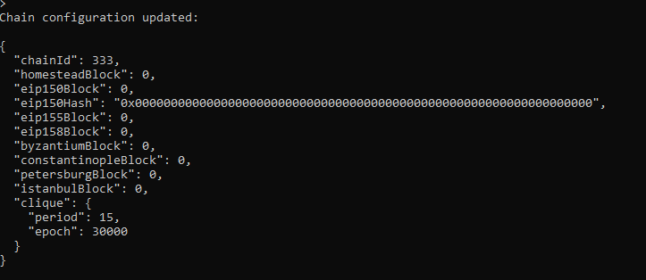

# ZBCoin - Proof of Authority Development Chain

For this assignment, I have set up a private testnet blockchain for ZBank.

## Environment Setup Instructions and Dependencies

### Installing MyCrypto Desktop App

Download [MyCrypto](https://www.mycrypto.com/) Desktop App to manage ethereum wallets and make transactions in the blockchain.

## Go Ethereum Tools

[Go Ethereum](https://geth.ethereum.org/) is one of the three original implementations of the Ethereum protocol. It is written in Go, fully open-source and licensed under the GNU LGPL v3. Go Ethereum Tools are included in this repo.

## Launch the Testnet

**Important Note:** Windows users **MUST** use `git-bash` and not the default Windows command prompt when you are requested to open the terminal window to execute commands.

### Configuration of the ZBCoin testnet



### Start Node1 

* Open a terminal window, navigate to the zbcoin folder and run the following command: 

  ```bash
  ./geth --datadir node1 --unlock "SEALER_ONE_ADDRESS" --mine --minerthreads 1
  ```
* Substitute the "SEALER_ONE_ADDRESS" with the the public address of the first node listed in Keys.txt (do **not** include the leading `0x`). 

* Example:

  ```bash
  ./geth --datadir node1 --unlock "f62c095543d750db3a6bd7476952db0e69bf253f" --mine --minerthreads 1
  ```
* **Important:** Type your password and hit enter - _even if you don't see a prompt!_ (password in Key.txt)

* Copy the resulting enode address from the terminal:


   

---

## Start Node2

Commands differ based on OS; choose your system below.

<details><summary>Windows</summary>

* Start node two by opening a second new terminal and running the following command: 

  ```bash     
  ./geth --datadir node2 --unlock "SEALER_TWO_ADDRESS" --port 30304 --rpc --bootnodes "SEALER_ONE_ENODE_ADDRESS" --ipcdisable --allow-insecure-unlock   
  ```
* Substitute the "SEALER_TWO_ADDRESS" with the the public address of the second node that was created in the previous session. (do **not** include the leading `0x`).

* Substitute the "SEALER_ONE_ENODE_ADDRESS" with the enode address of node 1 that was copied in step 1.  

* For example:

  ```bash
  ./geth --datadir node2 --unlock "0a8435117d77c184fd35a75d4dce4390369094f7" --port 30304 --rpc --bootnodes "enode://330481ab62dbf7fc47213e83975196156b0d842c4c81439dd888ff2de20afd174ac2062229376f9b8d0c70c31eaa2c8d5f0105db97ea4f72a50839b2b9c6c8f9@127.0.0.1:30303" --ipcdisable --allow-insecure-unlock
  ```  

* **Important**: Type your password and hit enter - _even if you don't see a prompt!_

* The chain should be up and running after you start the second node.

</details>

<details><summary>macOS</summary>

* Start node two by opening a second new terminal and running the following command: 

  ```bash
  ./geth --datadir node2 --unlock "SEALER_TWO_ADDRESS" --port 30304 --rpc --bootnodes "SEALER_ONE_ENODE_ADDRESS" --allow-insecure-unlock
  ```
* Substitute the "SEALER_TWO_ADDRESS" with the the public address of the second node listed in Keys.txt. (do **not** include the leading `0x`).

* Substitute the "SEALER_ONE_ENODE_ADDRESS" with the enode address of node 1 that was copied in step 1.  

* For example:

  ```bash
  ./geth --datadir node2 --unlock "0a8435117d77c184fd35a75d4dce4390369094f7" --port 30304 --rpc --bootnodes "enode://330481ab62dbf7fc47213e83975196156b0d842c4c81439dd888ff2de20afd174ac2062229376f9b8d0c70c31eaa2c8d5f0105db97ea4f72a50839b2b9c6c8f9@127.0.0.1:30303" --allow-insecure-unlock
  ```

* **Important**: Type your password and hit enter - even if you don't see a prompt!

* The chain should be up and running after you start the second node.

</details>

---

## Send a test transaction

* Use the MyCrypto GUI wallet to connect to the node with the exposed RPC port.

* You will need to use a custom network, and include the chain ID, and use ETH as the currency.


* Import the keystore file from the `node1/keystore` directory into MyCrypto. This will import the private key.

* Send a transaction from the `node1` account to the `node2` account.

* Copy the transaction hash and paste it into the "TX Status" section of the app, or click "TX Status" in the popup.

* Voila, you just made the first successful transaction on ZBCoin testnet!


